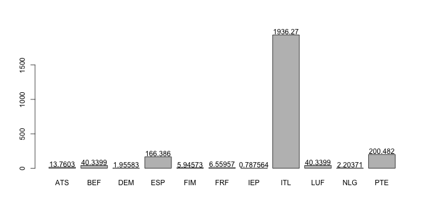

## Introduction

This shiny project is designed for online European currency conversion.
  
There are 11 European currencies:  
-Austrian Schilling ATS  
-Belgian Franc BEF  
-German Mark DEM  
-Spanish Peseta ESP   
-Finnish Markka FIM  
-French Franc FRF  
-Irish Punt IEP  
-Italian Lira ITL   
-Luxembourg Franc LUF   
-Dutch Guilder NLG  
-Portuguese Escudo PTE   
-Euro  
  
These conversion rates were fixed by the European Union on December 31, 1998.

--- 

## The dataset


```r
library(datasets)
data(euro)
```

Here use rCharts to plot the data. The value refers to the value of 1 euro in that currency. Notice this interactive figure can only display locally but not on RPub.  


You can also view the figure in a static state like this.  


--- 

## The little math in currency conversion from A to B
1 currency A is equivalent to $$1\times \frac{Value(B)}{Value(A)}$$ of currency B.

---

## The shiny app 
Try the shiny app for European currency conversion

https://mollihua.shinyapps.io/project_DevelopingDataProducts/  

The R markdown file is at:  
https://github.com/mollihua/DevelopingDataProducts_project2/blob/master/index.Rmd

Please email Mo Chen (mochenserey@gmail.com) for any questions.Thank you.


